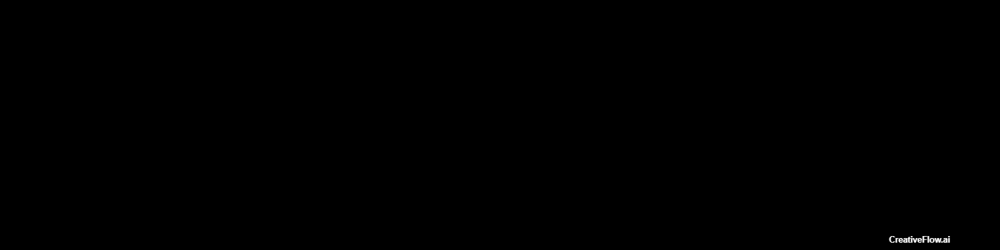

  
  <h1>Hai, I am <a href="https://edwineas.github.io/personal-site/" target="_blank">Edwin</a> </h1> 
  <h2>About me 👨‍💻</h2>
  

    🎯 My goal is to become a Full-Stack Developer 
    🌐 I'm committed to contributing to the tech community 
    🎓 I'm continuously improving my skills and knowledge 
    🚀 I'm always seeking new opportunities to challenge myself 
    🤝 I'm open to collaborating with like-minded individuals and teams 
  
 
  <h2>Connect with me 🙋‍♂️</h2>
  
  
  
    
  <h2>Languages and Tools</h2>
     
  

